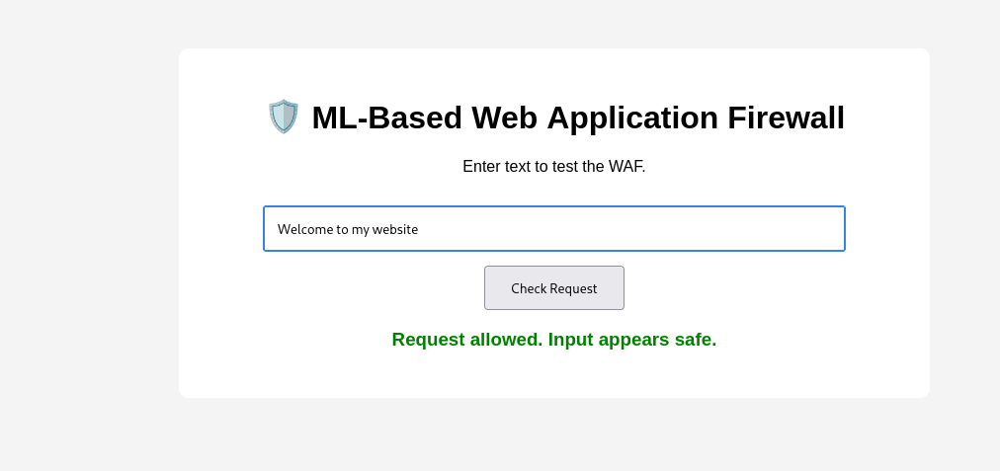
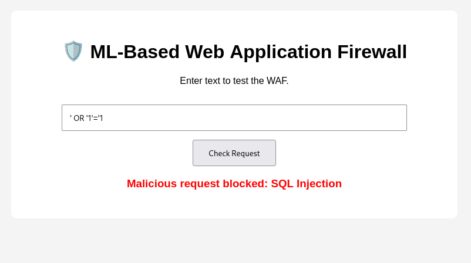
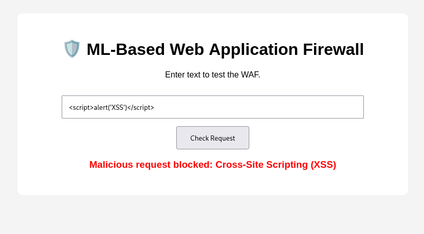
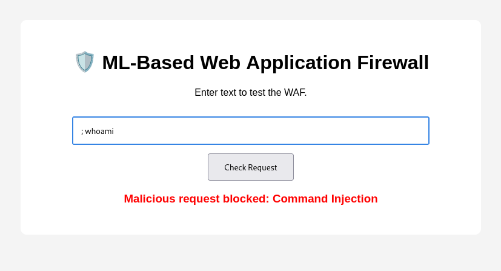
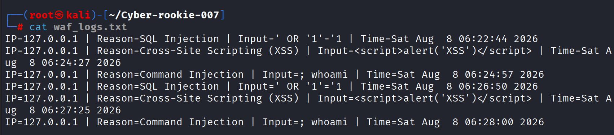

# 🛡️ ML-Based Web Application Firewall (WAF)

A learning project that demonstrates a Web Application Firewall (WAF) using Python, Flask, and Machine Learning to detect and block common web-based attacks.

## 📌 Project Overview

This project demonstrates how a basic Web Application Firewall can inspect incoming web requests and identify potentially malicious input.

The WAF combines **rule-based detection** with a **machine-learning-based classifier** to identify suspicious requests.

## 🚀 Features

* SQL Injection detection
* Cross-Site Scripting (XSS) detection
* Command Injection detection
* Machine-learning-based input classification
* Rate limiting
* Progressive IP blocking
* Logging of malicious requests

## 🧠 How It Works

The application processes user input through multiple security checks:

1. Incoming input is received by the Flask application.
2. Rule-based patterns are used to identify known malicious inputs.
3. Suspicious input is passed to a machine-learning classifier.
4. Malicious requests are blocked.
5. Blocked activity is recorded in the WAF logs.
6. Repeated suspicious requests can trigger temporary IP blocking or rate limiting.
7. Safe requests are allowed to continue.

## 🛠️ Technologies Used

* Python
* Flask
* Scikit-learn
* Joblib
* HTML/CSS
* Machine Learning

## 📂 Project Structure

```text
Cyber-rookie-007/
│
├── app.py
├── train_model.py
├── waf_model.pkl
├── vectorizer.pkl
├── waf_logs.txt
├── screenshots/
│   ├── safe-request.png
│   ├── sql-injection-blocked.png
│   ├── xss-blocked.png
│   ├── command-injection-blocked.png
│   └── waf-logs.png
│
└── README.md
```

## ▶️ Setup and Usage

### 1. Clone the repository

```bash
git clone https://github.com/Cyber-rookie-007/Cyber-rookie-007.git
cd Cyber-rookie-007
```

### 2. Create a virtual environment

```bash
python3 -m venv venv
```

Activate the virtual environment:

```bash
source venv/bin/activate
```

### 3. Install the required dependencies

```bash
pip install flask scikit-learn joblib
```

### 4. Train the machine-learning model

```bash
python train_model.py
```

After successful training, the model files are generated:

```text
waf_model.pkl
vectorizer.pkl
```

### 5. Start the Flask application

```bash
python app.py
```

### 6. Open the application

Open the following address in your browser:

```text
http://127.0.0.1:5000
```

### 7. Test the WAF

Submit normal and representative malicious inputs through the web interface.

Example SQL Injection input:

```text
' OR '1'='1
```

Example XSS input:

```text
<script>alert('XSS')</script>
```

Example Command Injection input:

```text
; whoami
```

Detected malicious requests are blocked and recorded in:

```text
waf_logs.txt
```

### 8. Stop the application

To stop the Flask application:

```text
Ctrl + C
```

To deactivate the virtual environment:

```bash
deactivate
```

## 🧪 Security Testing

The WAF was tested in a local environment using both benign and representative malicious inputs.

### Safe Input

```text
Welcome to my website
```

### SQL Injection

```text
' OR '1'='1
```

### Cross-Site Scripting (XSS)

```text
<script>alert('XSS')</script>
```

### Command Injection

```text
; whoami
```

The WAF analyzes the submitted input and blocks requests identified as malicious.

## 📊 Logging

Malicious requests detected by the WAF are recorded in:

```text
waf_logs.txt
```

Example log entry:

```text
IP=127.0.0.1 | Reason=SQL Injection | Input=' OR '1'='1 | Time=...
```

The log can be used to review detected activity and understand how the WAF responds to suspicious requests.

## 📸 Screenshots

### Safe Request



### SQL Injection Detection



### Cross-Site Scripting (XSS) Detection



### Command Injection Detection



### WAF Logging



## 🎯 Learning Objectives

This project is intended to provide practical exposure to:

- Web application security
- WAF concepts
- Rule-based attack detection
- Machine-learning-based classification
- Flask web applications
- Request filtering
- Rate limiting
- Security logging

## ⚠️ Disclaimer

This project is intended for educational and cybersecurity learning purposes. Security testing should be performed only against applications and systems that you own or are explicitly authorized to test.

## 🔮 Future Improvements

Possible improvements include:

- Real-time security monitoring dashboard
- SIEM integration
- Docker deployment
- Reverse-proxy integration
- Cloud deployment
- Improved machine-learning dataset
- Advanced anomaly detection

## 👤 Author

Pavan Kumar Poli

GitHub: https://github.com/Cyber-rookie-007
